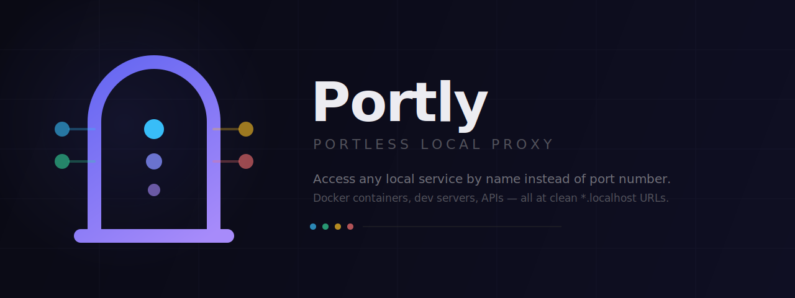

<p align="center">
  
</p>

<p align="center">
  <a href="https://github.com/Bedri-B/Portly/actions/workflows/build.yml"></a>
  <a href="LICENSE"></a>
  <a href="https://github.com/Bedri-B/Portly/releases/latest"></a>
  <a href="https://github.com/Bedri-B/Portly/stargazers"></a>
</p>

<p align="center"><strong>Stop memorizing port numbers. Access every local service by name.</strong></p>

**Portly** is a local reverse proxy that lets you reach any service — Docker containers, dev servers, APIs — through clean URLs like `http://myapp.localhost` instead of `localhost:3000`.

No changes to how you start your services. No wrapping commands. Just run `portly` and add aliases.

```bash
portly alias myapp 3000
portly alias api 8080

curl http://myapp.localhost    # -> localhost:3000
curl https://api.localhost     # -> localhost:8080
```

---

## Table of Contents

- [Install](#install)
- [How it works](#how-it-works)
- [CLI](#cli)
- [Dashboard](#dashboard)
- [Configuration](#configuration)
- [HTTPS](#https)
- [API](#api)
- [Running as a service](#running-as-a-service)
- [Updating](#updating)
- [Contributing](#contributing)
- [License](#license)

## Install

**macOS / Linux:**

```bash
curl -fsSL https://raw.githubusercontent.com/Bedri-B/Portly/main/scripts/install.sh | bash
```

**Windows (PowerShell):**

```powershell
irm https://raw.githubusercontent.com/Bedri-B/Portly/main/scripts/install.ps1 | iex
```

Downloads the latest release, puts it on your PATH, ready to go.

### Uninstall

**macOS / Linux:**

```bash
curl -fsSL https://raw.githubusercontent.com/Bedri-B/Portly/main/scripts/uninstall.sh | bash
```

**Windows (PowerShell):**

```powershell
irm https://raw.githubusercontent.com/Bedri-B/Portly/main/scripts/uninstall.ps1 | iex
```

<details>
<summary>Build from source</summary>

```bash
git clone https://github.com/Bedri-B/Portly.git && cd Portly
pip install pyinstaller
cd web && npm install && npm run build && cd ..
python scripts/build.py   # outputs dist/portly
```

Or run directly without building: `python -m portly`

</details>

## How it works

```
http://myapp.localhost   ->  proxy (:80)   ->  localhost:3000
https://api.localhost    ->  proxy (:443)  ->  localhost:8080
```

Portly builds a route table from three sources:

| Source | Description |
|--------|-------------|
| **Aliases** | You map a name to a port: `portly alias myapp 3000` |
| **Docker** | Auto-discovers running containers with published ports |
| **Port scan** | Probes common dev ports and custom ranges for anything listening |

The route table refreshes every 10 seconds. Aliases are persisted in `config.json`.

## CLI

```
portly                            Start server + open dashboard
                                  (opens dashboard if already running)
portly start                      Start server in background
portly stop                       Stop background server
portly restart                    Restart server
portly status                     Show running status

portly alias <name> <port>        Map name.localhost -> localhost:port
portly alias <name> --remove      Remove an alias
portly aliases                    List all aliases with status

portly install                    Install as system service (start on boot)
portly uninstall                  Remove system service

portly update                     Check for updates and install
portly help                       Show help
```

## Dashboard

Portly ships with a web dashboard at `http://localhost:19802`:

- **Services** — all active routes with clickable URLs and source labels
- **Aliases** — add/remove aliases, configure port scanning
- **Settings** — domain, ports, HTTPS, Docker discovery, startup, and updates

## Configuration

A `config.json` is created next to the binary on first run:

```json
{
  "proxy_port": 80,
  "https_port": 443,
  "domain": ".localhost",
  "https_enabled": false,
  "docker_discovery": true,
  "auto_start": true,
  "auto_update": false,
  "aliases": {},
  "scan_ports": [],
  "scan_ranges": [],
  "scan_common": true
}
```

| Key | Default | What it does |
|-----|---------|--------------|
| `proxy_port` | `80` | HTTP proxy. Use 80 for portless URLs |
| `https_port` | `443` | HTTPS proxy |
| `domain` | `.localhost` | Suffix for service URLs |
| `https_enabled` | `true` | HTTPS with auto-generated certs |
| `docker_discovery` | `true` | Auto-detect Docker container ports |
| `auto_start` | `true` | Start portly on system boot |
| `auto_update` | `false` | Auto-install updates (checks hourly) |
| `aliases` | `{}` | Name-to-port mappings |
| `scan_ports` | `[]` | Extra individual ports to probe |
| `scan_ranges` | `[]` | Port ranges to scan, e.g. `[[3000, 3010]]` |
| `scan_common` | `true` | Scan ~50 well-known dev server ports |

Everything is also configurable from the dashboard.

## HTTPS

Disabled by default. Enable it from the dashboard or config for trusted `https://name.localhost` URLs with no browser warnings.

### Quick setup (recommended)

1. Open the dashboard: `http://localhost:19802/settings`
2. Click **"Install certificates"** in the HTTPS card
3. Toggle **"Enable HTTPS proxy"** on
4. Click **Save**, then restart portly (`portly restart`)

This automatically installs [mkcert](https://github.com/FiloSottile/mkcert), adds a root CA to your system trust store, and generates certificates for your configured domain. With the default `.localhost` domain, browsers will trust all `https://name.localhost` URLs immediately. If you change the domain (e.g. `.test`), regenerate certs and they'll cover `*.test` too.

### Manual setup

If you prefer to set it up yourself:

```bash
# Install mkcert
# Windows: winget install FiloSottile.mkcert
# macOS:   brew install mkcert
# Linux:   apt install mkcert  (or download from GitHub)

# Install root CA (one-time, requires admin on Windows)
mkcert -install

# Generate certs
mkdir -p certs
mkcert -cert-file certs/localhost.pem -key-file certs/localhost-key.pem \
  localhost "*.localhost" 127.0.0.1 ::1

# Enable in config
# Set "https_enabled": true in config.json, then restart portly
```

### Config options

| Key | Default | Description |
|-----|---------|-------------|
| `https_enabled` | `false` | Enable HTTPS proxy on `https_port` |
| `https_port` | `443` | HTTPS listen port (falls back to `19444` if 443 needs admin) |

### Certificate fallbacks

If mkcert is not available, portly falls back to:
1. **openssl** — generates a self-signed cert (browser will show warnings)
2. **Python cryptography** — last resort

Certs are stored in `certs/` next to the binary.

## API

All endpoints are on the API port (default `19800`) and also proxied through the dashboard port (`19802`).

```bash
# List all services
curl localhost:19800/api/services

# Add an alias
curl -X POST localhost:19800/api/aliases -d '{"name":"myapp","port":3000}'

# Remove an alias
curl -X DELETE localhost:19800/api/aliases/myapp

# Get full status
curl localhost:19800/api/status
```

<details>
<summary>Full endpoint reference</summary>

| Method | Endpoint | Description |
|--------|----------|-------------|
| `GET` | `/api/status` | Services, config, aliases, version |
| `GET` | `/api/services` | All routed services |
| `GET` | `/api/aliases` | All aliases |
| `POST` | `/api/aliases` | Add alias `{"name", "port"}` |
| `DELETE` | `/api/aliases/{name}` | Remove alias |
| `POST` | `/api/refresh` | Force refresh routes |
| `GET` | `/api/config` | Current config |
| `PUT` | `/api/config` | Update config |
| `POST` | `/api/scan` | Update scan config |
| `GET` | `/api/update/check` | Check for updates |
| `POST` | `/api/update/apply` | Download and install update |
| `POST` | `/api/startup/install` | Enable start-on-boot |
| `POST` | `/api/startup/uninstall` | Disable start-on-boot |

</details>

## Running as a service

```bash
portly install      # auto-starts on boot
portly uninstall    # remove
```

Uses **nssm** on Windows, **systemd** on Linux, **launchd** on macOS. Also configurable from the dashboard Settings page.

## Updating

```bash
portly update       # check and install latest release
```

Or enable auto-updates in the dashboard (Settings > Updates) or in `config.json`:

```json
{ "auto_update": true }
```

When enabled, portly checks for updates hourly and installs them automatically.

## Development

### Quick start

```bash
git clone https://github.com/Bedri-B/Portly.git && cd Portly

# One-command setup (installs deps, builds dashboard)
bash scripts/dev-setup.sh          # macOS/Linux
powershell scripts/dev-setup.ps1   # Windows
```

### Running locally

```bash
# Backend + frontend together (recommended)
python scripts/dev.py

# Backend only
python -m portly --no-browser      # foreground, shows logs

# Frontend with hot reload (separate terminal)
cd web && npm run dev              # Vite on :5173
```

When running both, use `http://localhost:5173` — Vite proxies `/api/*` to the backend and hot-reloads on changes.

### Pre-commit checks

```bash
python scripts/check.py
```

Verifies all Python compiles, frontend builds, and required files exist.

### Project structure

```
portly/              Python package (stdlib only, no pip deps at runtime)
  cli.py             CLI commands (start, stop, alias, update)
  server.py          Server launchers, PID management
  api.py             REST API endpoints
  proxy.py           Reverse proxy (routes *.localhost to services)
  registry.py        Route registry (Docker + aliases + port scan)
  discovery.py       Docker discovery, parallel port scanning
  tls.py             Certificate generation + mkcert management
scripts/             Dev tooling, build, install scripts
web/                 React dashboard (Vite + TypeScript)
```

See [CONTRIBUTING.md](CONTRIBUTING.md) for architecture details and contribution guidelines.

## Contributing

Contributions are welcome! Please read the [Contributing Guide](CONTRIBUTING.md) before submitting a PR.

- [Report a bug](https://github.com/Bedri-B/Portly/issues/new?template=bug_report.yml)
- [Request a feature](https://github.com/Bedri-B/Portly/issues/new?template=feature_request.yml)

This project follows the [Contributor Covenant Code of Conduct](CODE_OF_CONDUCT.md).

## License

[MIT](LICENSE) &copy; [Bedri B.](https://github.com/Bedri-B)
